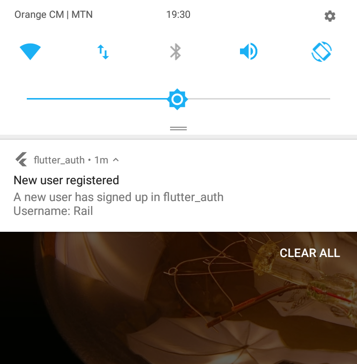
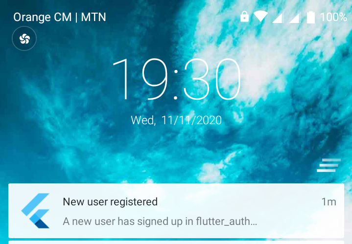

# flutter_auth

This is a simple flutter application that enables its users to:
*   **Sign up** into the app.
*   **Sign in** into their accounts.
*   **Sign out** from the app.
*   **Display** other usernames of the other app users.
*   **Notify** users upon successful signing up of new app users.

## Development 
*   [Flutter](https://flutter.dev/)
*   [ParseServer](https://back4app.com/)(Back4App)
*   [Firebase](https://google.firebase.com/)

## Getting Started

This project is a starting point for a Flutter application.

A few resources to get you started if this is your first Flutter project:

- [Lab: Write your first Flutter app](https://flutter.dev/docs/get-started/codelab)
- [Cookbook: Useful Flutter samples](https://flutter.dev/docs/cookbook)

For help getting started with Flutter, view our
[online documentation](https://flutter.dev/docs), which offers tutorials,
samples, guidance on mobile development, and a full API reference.

### Sign up page
Sign up using emmail, username, and password.

### Push notificationse
Push Notifications are triggered from the client-side to all registered app users.
**NOTE**: Push notifications are only visible when connected to the internet at the moment the user signs-up, while your own app is **running in the background**.

Notification from the status bar and the lock screen.

### Sign in page
Sign in using a emmail/username, and password.

### Home page

### Users Page

